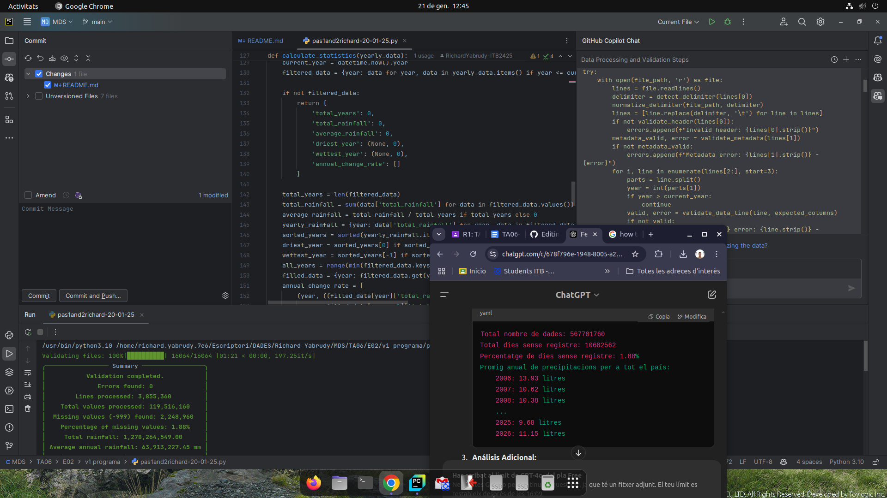
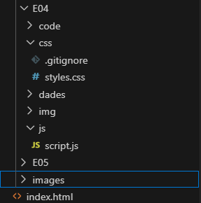
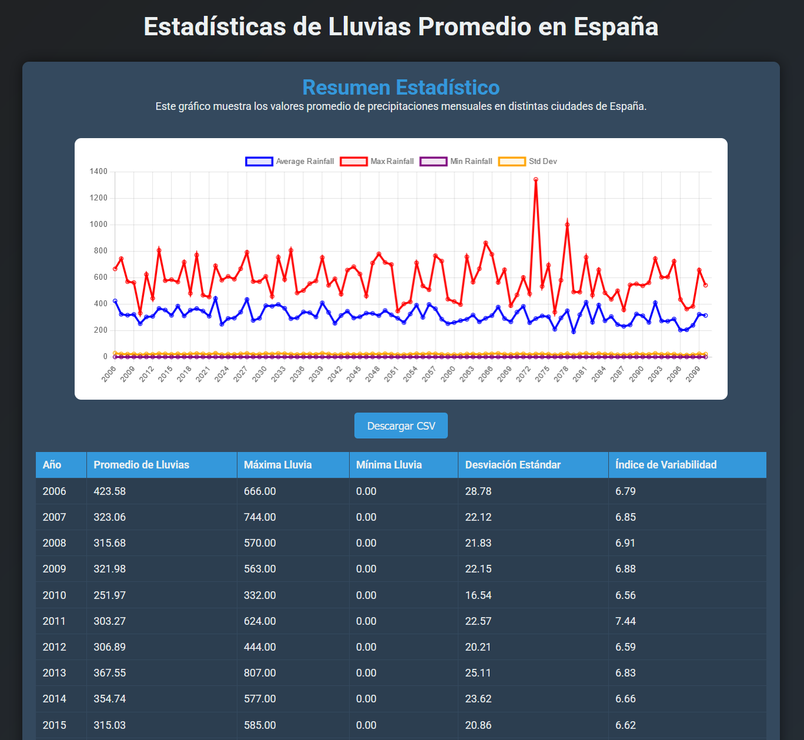
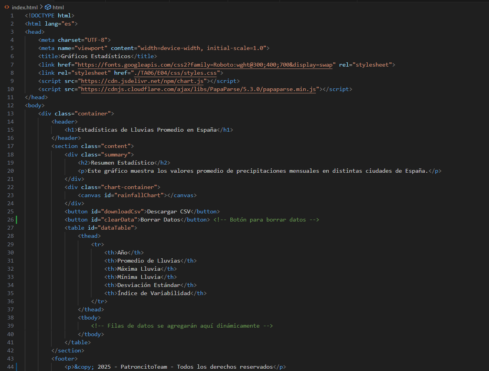
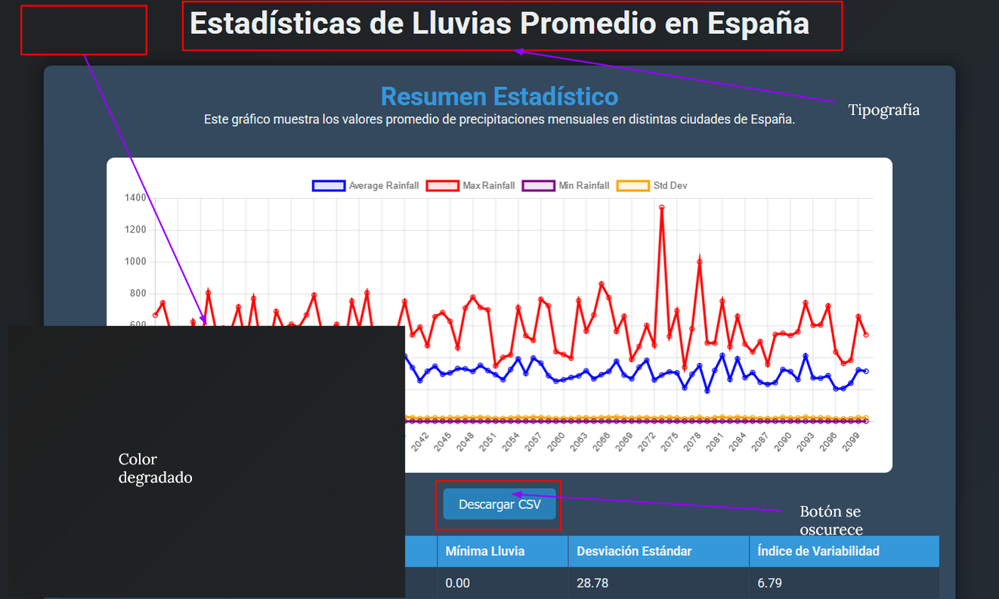
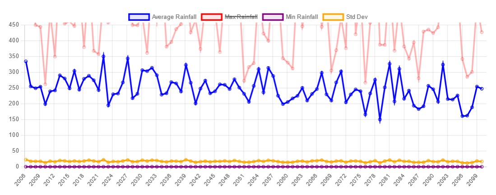

# TA06-Garcia-Erick-Yabrudy-Richard-Francisco-Diaz-Grupo03
The objective of this task, is to use the power of data and the most advanced AI technologies trained with “our expertise”, to tailor solutions in the green transformation, be it decarbonization, decontamination, resource saving and regeneration, or any other solution.

<div align="center">
   <h1>
      <a href="index.html">Ir a mi página principal</a>
   </h1>
</div>


# 01 Obtencion de datos
Dentro del la web _AEMET_ debemos de obtener una API Key ingresando nuestro email, el generador de key debera llegar al correro electronico, donde posteriormente llegara un mensaje con la key, esto debera ser realizado por un solo usuario del grupo.


Una vez obtenidas las credenciales, buscamos el apartado correspondiente a la tarea, dentro de este debemos de filtrar la informacion a lo necesario para la practica, siendo los parametros los siguientes:
 - Método: Regresión Rejilla
 - Modelo: MIROC5
 - Escenarios: RCP6.0
 - Variable: Precipitación
 - Periodo: 2006 - 2100
 


El archivo que descaragaremos tendra un tamaño de 360MB el cual es un .tar.gz:


Una vez descargado y extraido, el mismo se debe de subir a uno de los directorios de TA06, en este caso el E01, finalmente mostrandose de la siguiente manera:


Al abrir cada archivo de datos se muestra, lo siguiente:


# 02 Organización y procesamiento de datos
Para organizar y procesar las datos, seguimos estos pasos:  

## Lectura de archivos:  


- Revisamos las cabeceras, la separación entre datos, comentarios, etc. 

`header = f.readline().strip()`

- Detectamos delimitadores (espacios, comas o tabulaciones).

`delimiter = detect_delimiter(header)`


- Verificamos que todos los archivos tienen el mismo formato, y que no hubieran otros diferentes.

## Verificación del formato:  

- Creamos un script de validación básica para leer las primeras filas de cada archivo y determinar el número de columnas y delimitadores.

`columns = len(header.split(delimiter))`

- Nos aseguramos de que las columnas tenían el tipo de datos esperado (numérico, fecha, etc.).

## Limpieza de datos:  

- Gestionamos los errores de lectura utilizando pandas.

```python
import pandas as pd
df = pd.read_csv(file_path, delimiter=delimiter, error_bad_lines=False)
```

- Además verificamos la consistencia de las columnas.
- E identificamos y tratamos datos nulos o valores atípicos.

## 03 Validación y cálculo de estadísticas

Para validar los archivos y calcular estadísticas, actualizamos nuestro script en Python.


*El fotógrafo estaba trabajando también dentro del trabajo y fue quien tomó la foto ;)*

Este proceso nos costó mucho esfuerzo y tuvimos que pulirlo varias veces porque no paraba de fallar el script o el Copilot generaba código que requería supervisión. 



Finalmente, logramos que funcionara correctamente, y actualmente realiza las siguientes tareas:

- Detecta y normaliza delimitadores.

normalize_delimiter(file_path, delimiter)

- Valida encabezados y metadatos.

```python
if not validate_header(lines[0]):
    errors.append(f"Invalid header: {lines[0].strip()}")
```


- Verifica la consistencia de los datos.

`valid, error = validate_data_line(line, expected_columns)`

- Calcula estadísticas anuales de precipitación.

`total_rainfall += rainfall`

- Muestra un resumen de la validación y la tasa de cambio anual de las precipitaciones.

## 04 Resultados

Al finalizar la validación, obtuvimos las siguientes estadísticas:  

- Errores encontrados: Número total de errores en los archivos.
- Líneas procesadas: Número total de líneas procesadas.
- Valores totales procesados: Número total de valores procesados.
- Valores faltantes (-999): Número total de valores faltantes.
- Porcentaje de valores faltantes: Porcentaje de valores faltantes respecto al total.
- Precipitación total: Precipitación total acumulada.
- Precipitación media anual: Precipitación media anual.
- Año más seco: Año con la menor precipitación.
- Año más lluvioso: Año con la mayor precipitación.

Además, mostramos la tasa de cambio anual de las precipitaciones en formato tabular.

## 05 Representación en base a las estadísticas

## Reporte de Cambios en la Generación de Gráficos y Cálculo del Tiempo

### Generación de Gráficos

1. **Inclusión de Timestamps en los Nombres de los Archivos:**
   - Se añadió una marca de tiempo (timestamp) a los nombres de los archivos de los gráficos generados para evitar la sobrescritura cuando el código se ejecuta más de una vez al día.
   - La marca de tiempo se obtiene utilizando `current_time = datetime.now().strftime("%Y%m%d%H%M%S")`.

2. **Generación de Gráficos:**
   - Se crearon dos gráficos:
     - **Promedio Móvil de Precipitación:** Un gráfico de serie temporal que muestra el promedio móvil de la precipitación anual.
     - **Variación Estacional de Precipitación:** Un boxplot que muestra la variación estacional de la precipitación mensual.

3. **Nombres de los Archivos de Gráficos:**
   - Los nombres de los archivos de los gráficos incluyen la marca de tiempo para asegurar que cada archivo generado es único. Los archivos se guardan como `precipitation_trend_{current_time}.png` y `seasonal_variation_{current_time}.png`.

### Cálculo del Tiempo de Generación de Gráficos

1. **Medición del Tiempo de Generación:**
   - Se utilizó el módulo `time` para capturar el tiempo antes y después de la generación de cada gráfico.
   - La diferencia de tiempo se calculó y se imprimió en la consola para mostrar cuánto tiempo tomó generar cada gráfico.

2. **Código para la Medición del Tiempo:**
   - Antes de generar cada gráfico, se captura el tiempo de inicio: `start_time = time.time()`.
   - Después de generar cada gráfico, se captura el tiempo de finalización: `end_time = time.time()`.
   - Se calcula la duración restando `start_time` de `end_time` y se imprime en la consola.

### Ejemplo de Código

```python
# Obtener la marca de tiempo actual para los nombres de archivos
current_time = datetime.now().strftime("%Y%m%d%H%M%S")

# Medir el tiempo para generar el primer gráfico
start_time = time.time()
plt.figure(figsize=(12, 6))
plt.plot(annual_totals['year'], annual_totals['rolling_avg'])
plt.title('Promedio Móvil de Precipitación')
plt.xlabel('Año')
plt.ylabel('Promedio Móvil de Precipitación')
plt.grid(True)
plt.savefig(f'precipitation_trend_{current_time}.png')
plt.close()
end_time = time.time()
print(f"Tiempo para generar el gráfico de Promedio Móvil de Precipitación: {end_time - start_time:.2f} segundos")

# Medir el tiempo para generar el segundo gráfico
start_time = time.time()
plt.figure(figsize=(10, 6))
sns.boxplot(x='month', y='total_rainfall', data=monthly_totals)
plt.title('Variación Estacional de Precipitación')
plt.xlabel('Mes')
plt.ylabel('Precipitación Total')
plt.grid(True)
plt.savefig(f'seasonal_variation_{current_time}.png')
plt.close()
end_time = time.time()
print(f"Tiempo para generar el gráfico de Variación Estacional de Precipitación: {end_time - start_time:.2f} segundos")
```

### ¿Qué podemos sacar de todo esto?

Estos cambios aseguran que cada ejecución del código genera gráficos únicos y permite medir y reportar el tiempo de generación de los gráficos de manera precisa. Esto es útil para el monitoreo del rendimiento y para evitar conflictos de nombres de archivos en ejecuciones múltiples en el mismo día.


## 06 Cambios de código, generación de estadísticas y CSV.

En esta sección, describimos el progreso actual del proyecto, incluyendo las similitudes y cambios respecto al código anterior, así como la implementación de la página web para la visualización de los resultados.

1. **Similitudes y Cambios:**
   - Continuamos utilizando bibliotecas como pandas, matplotlib, y numpy para el procesamiento y visualización de datos.
   - Seguimos capturando el tiempo de generación de gráficos para monitorear el rendimiento.

```python

import os
import sys
import pandas as pd
import matplotlib.pyplot as plt
from datetime import datetime
from rich.console import Console
from rich.panel import Panel
from rich.text import Text
from tqdm import tqdm
import numpy as np

console = Console()

# Configurar ruta base del script
BASE_DIR = os.path.dirname(os.path.abspath(__file__))
DATA_DIR = os.path.join(BASE_DIR, "../E01/data")
OUTPUT_DIR = os.path.join(BASE_DIR, "output")

# Crear subcarpetas para gráficos y estadísticas
STATS_DIR = os.path.join(OUTPUT_DIR, "stats")
GRAPHS_DIR = os.path.join(OUTPUT_DIR, "graphs")
os.makedirs(STATS_DIR, exist_ok=True)
os.makedirs(GRAPHS_DIR, exist_ok=True)

# Funciones de validación y generación de resúmenes
# ...

if __name__ == "__main__":
    log_file_path = os.path.join(BASE_DIR, "validation_log.txt")
    validate_all_files(DATA_DIR, log_file_path)
   ```

2. **Cambios:**
   - Hemos añadido la biblioteca rich para mejorar la visualización de mensajes en la consola.
   - Implementamos la validación de archivos de datos, incluyendo la detección y normalización de delimitadores, y la validación de encabezados y metadatos.
   - Generamos resúmenes estadísticos detallados y los exportamos a archivos CSV.
   - Creamos gráficos estadísticos y los guardamos en un directorio específico.

3. **Página web:**
   
Hemos desarrollado una página web para publicar los datos generados por la aplicación. La página web está estructurada de la siguiente manera:

- HTML y CSS separados: Los archivos HTML y CSS están organizados en directorios separados para mantener una estructura limpia.

<div style="display: flex; align-items: flex-start; margin-bottom: 20px;">
    
</div>

- Recursos en directorios específicos: Las imágenes y otros recursos están almacenados en directorios dedicados.

4. **Contenido de la web:**

- Resúmenes estadísticos
- Gráficos estadísticos




Aquí podemos ver una previsualización de la página web, que incluye los resúmenes estadísticos en la tabla de abajo y los gráficos estadísticos en la parte superior de la página.


**HTML**

El HTML de nuestra página web está diseñado para ser claro y estructurado, facilitando la navegación y la comprensión de los datos presentados. Utilizamos etiquetas semánticas para mejorar la accesibilidad y el SEO. Aquí la muestra del mismo:



**CSS**

El estilo de nuestro CSS busca profesionalidad y simplicidad. Utilizamos una paleta de colores sobria y una tipografía clara para asegurar que la información sea fácilmente legible. El diseño es responsivo, adaptándose a diferentes tamaños de pantalla para mejorar la experiencia del usuario en dispositivos móviles y de escritorio.



**Javascript**

El JavaScript de nuestra página web se encarga de la interacción dinámica con los datos. Utilizamos Chart.js para crear gráficos interactivos y PapaParse para leer y parsear archivos CSV. Además, hemos añadido funcionalidad para borrar los datos en tiempo real.

Este gráfico permite filtrar la información, debido a que el gráfico es interactivo y utilizamos las librerías anteriormente mencionadas.

Aquí el fragmento del script que las contiene:

```
<script src="https://cdn.jsdelivr.net/npm/chart.js"></script>
<script src="https://cdnjs.cloudflare.com/ajax/libs/PapaParse/5.3.0/papaparse.min.js"></script>
```



Aquí en la imagen se puede ver el filtrado de la tabla en funcionamiento.

## Conclusión

El desarrollo de este proyecto nos ha permitido aplicar técnicas avanzadas de adquisición, limpieza, validación y análisis de datos climáticos, utilizando herramientas de inteligencia artificial y análisis estadístico. A lo largo del proceso, enfrentamos múltiples desafíos técnicos, desde la integración de las nuevas IAs, hasta la optimización de scripts para manejar grandes volúmenes de datos, lo que fortaleció nuestras habilidades en programación, automatización y procesamiento de información.

El resultado final es un sistema robusto y eficiente capaz de extraer, procesar y visualizar datos de precipitación de manera precisa y comprensible. La implementación de una página web interactiva, con gráficos y tablas dinámicas, permite una exploración intuitiva de los resultados, facilitando la interpretación de tendencias climáticas a lo largo del tiempo.

Este trabajo representa un paso significativo hacia la utilización del análisis de datos para comprender y mitigar los efectos del cambio climático. Además, la metodología y herramientas desarrolladas pueden adaptarse a futuros estudios en sostenibilidad y predicción climática, contribuyendo al avance de la ciencia de datos aplicada a la transformación verde.

En conclusión, hemos demostrado que el uso adecuado de datos y tecnología no solo mejora la toma de decisiones en temas ambientales, sino que también impulsa la innovación en el análisis climático. Los aprendizajes obtenidos en este proyecto servirán como base para futuras investigaciones y desarrollos en el campo de la ciencia de datos y la sostenibilidad.
